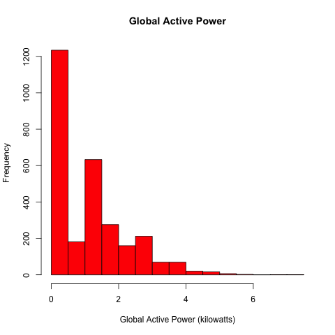
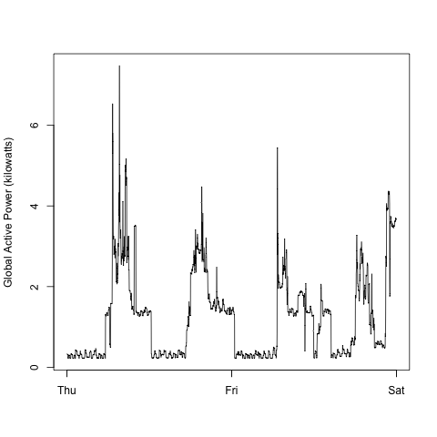
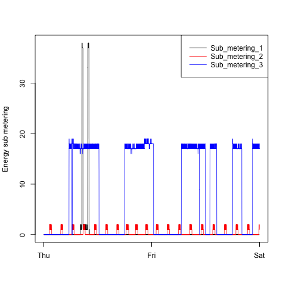
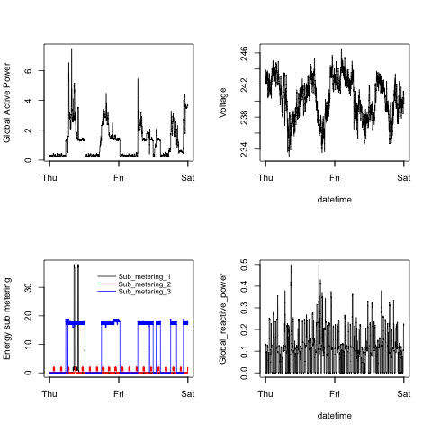

# Exploring Household Electric Power Usage
**Exploratory Data Analysis Course Project 1**

## Background and objectives

The objective of this assignment is to reporduce the plots specified in the project brief exploring household electric power consumption in the US, using dataset (Electric power consumption) [https://d396qusza40orc.cloudfront.net/exdata%2Fdata%2Fhousehold_power_consumption.zip] from UC Irvine Machine Learning Repository.

## Submitted Files
The following scripts have been submitted to GitHub repo: plot1.R, plot2.R, plot3.R, plot4.R, together with their corresponding outputs plot1.png, plot2.png, plot3.png, plot4.png.

## Output Plots
You can see the plots produced by the submitted R scripts below:

### Plot 1

### Plot 2

### Plot 3

### Plot 4

## Reference Plots
For reference, the original plots specified in the project brief (Plotting Assignment) [https://github.com/rdpeng/ExData_Plotting1] are below:
 

### Plot 2

 

### Plot 3

 

### Plot 4

 
